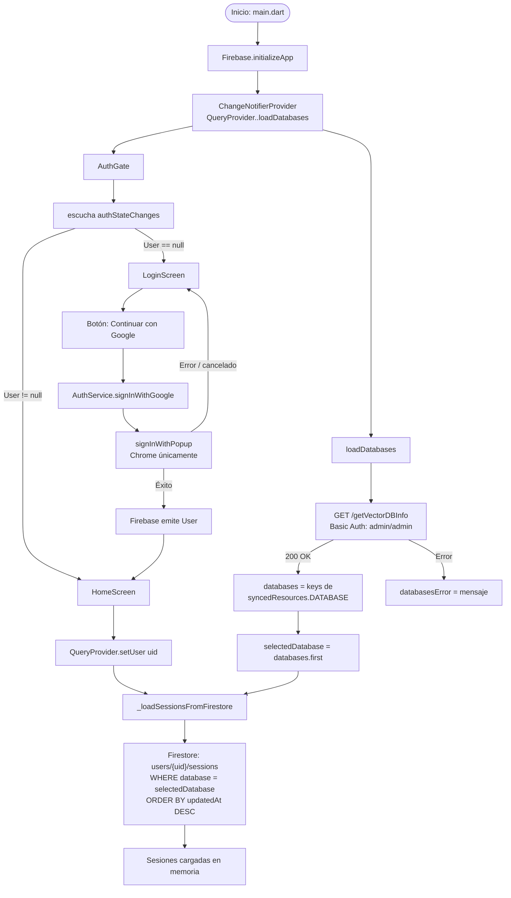
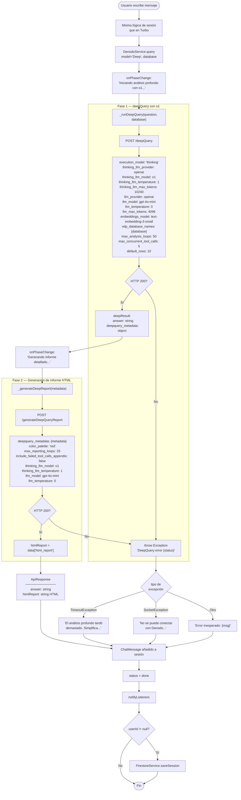
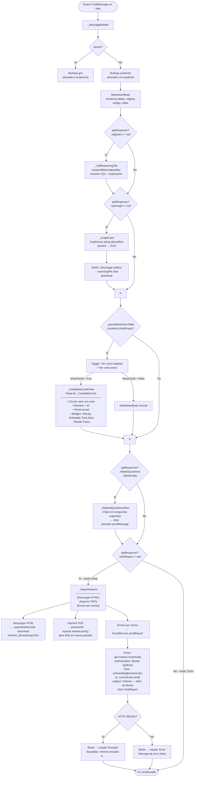
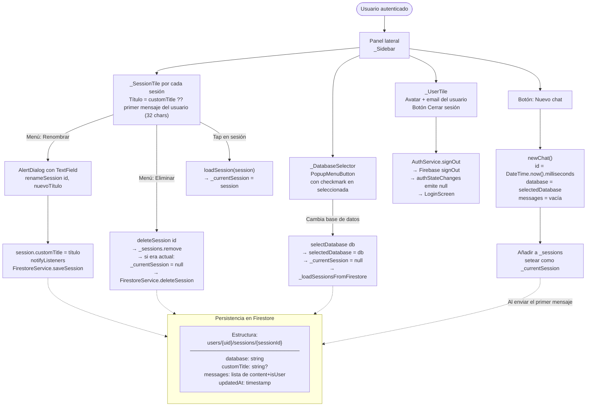
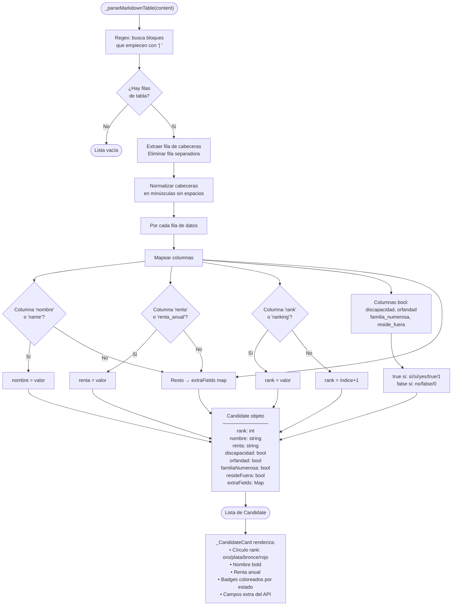

# Diagramas de Flujo — Administrador de Becas Inteligente

---

## 1. Arranque y Autenticación

---

## 2. Flujo de Consulta — Modo Turbo

```mermaid
flowchart TD
    A([Usuario escribe mensaje]) --> B{texto vacío\no isLoading?}
    B -->|Sí| Z([Ignorar])
    B -->|No| C{currentSession\n== null?}
    C -->|Sí| D["newChat()\nChatSession con id=timestamp\ndatabase=selectedDatabase"]
    C -->|No| E[Usar sesión actual]
    D --> E

    E --> F[Añadir ChatMessage usuario a sesión]
    F --> G["status = loading\nloadingPhase = 'Iniciando consulta...'"]
    G --> H{"wantsPlot?\nregex: gráfic|plot|chart|diagrama"}
    H --> I["DenodoService.query\nmodel='Turbo', database, plot"]

    I --> J["onPhaseChange:\n'Descubriendo esquema de datos...'"]
    J --> K["_discoverMetadata(question)"]

    subgraph FASE1["Fase 1 — Descubrimiento de metadatos"]
        K --> L["GET /answerMetadataQuestion"]
        L --> M["llm_model: gpt-4o-mini\nllm_temperature: 0\nembeddings_model: text-embedding-3-small\nvector_store_provider: chroma\nvector_search_k: 5\nmarkdown_response: false"]
        M --> N{HTTP 200?}
        N -->|No| ERR["throw Exception\n'Metadata error {status}'"]
        N -->|Sí| O["metadataContext = data['answer']"]
    end

    O --> P["onPhaseChange:\n'Consultando base de datos...'"]
    P --> Q["_queryData(question, metadataContext, plot)"]
    Q --> R["enrichedQuestion =\nquestion + '[Contexto de esquema]:\n' + metadataContext"]

    subgraph FASE2["Fase 2 — Consulta de datos y VQL"]
        R --> S["GET /answerDataQuestion"]
        S --> T["llm_model: gpt-4o-mini\nllm_temperature: 0\nllm_max_tokens: 4096\nplot: true/false\nvql_execute_rows_limit: 100\nllm_response_rows_limit: 25\nmarkdown_response: true\nexpand_set_views: true\nallow_external_associations: false"]
        T --> U{HTTP 200?}
        U -->|No| ERR
        U -->|Sí| V["ApiResponse.fromJson\n─────────────────\nanswer: string\nsqlQuery: string\nqueryExplanation: string\nrelatedQuestions: list\nrawGraph: base64 SVG\ntablesUsed: list"]
    end

    ERR --> EH{tipo de\nexcepción}
    EH -->|TimeoutException| ET["ApiResponse.error:\n'La consulta tardó demasiado...'"]
    EH -->|SocketException| ES["ApiResponse.error:\n'No se puede conectar con\nDenodo (localhost:8008)...'"]
    EH -->|Otro| EO["ApiResponse.error:\n'Error inesperado: {msg}'"]

    V --> FIN
    ET --> FIN
    ES --> FIN
    EO --> FIN

    FIN["ChatMessage.fromApiResponse\nañadido a sesión"] --> FIN2["status = done\nloadingPhase = ''"]
    FIN2 --> FIN3[notifyListeners]
    FIN3 --> FS{userId != null?}
    FS -->|Sí| FS2["FirestoreService.saveSession\nusers/{uid}/sessions/{sessionId}"]
    FS -->|No| END([Fin])
    FS2 --> END
```

---

## 3. Flujo de Consulta — Modo Deep

---

## 4. Renderizado de Respuesta en la UI

---

## 5. Gestión de Sesiones

---

## 6. Parseo de Tabla Markdown → Tarjetas de Candidatos

